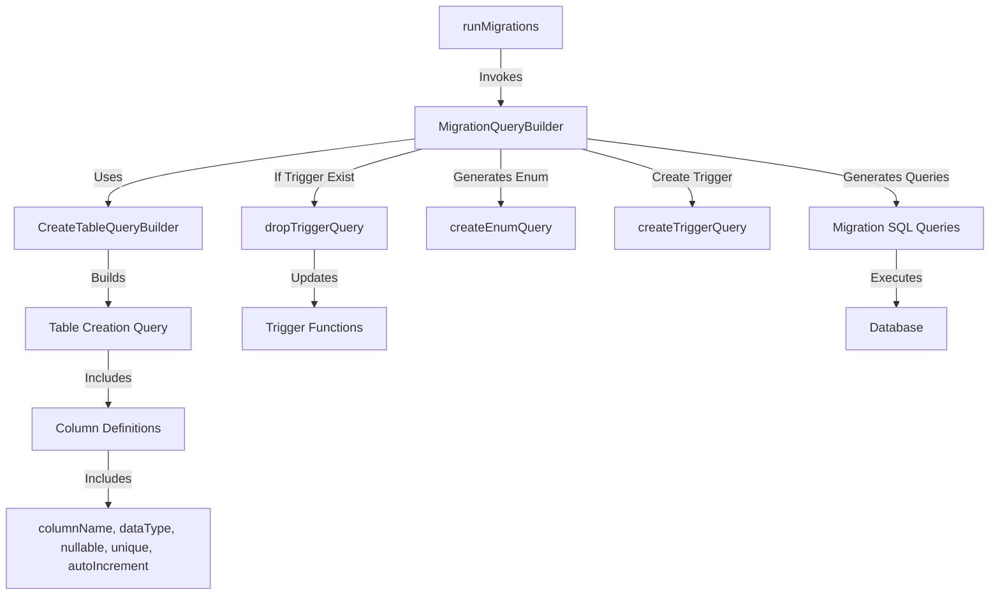
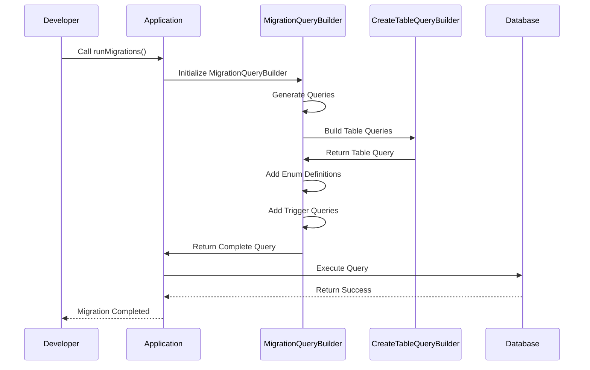

# dwi-express-orm

# Project Name

## Table of Contents
1. [Introduction](#introduction)
2. [Requirements](#requirements)
3. [Architecture](#architecture)
4. [Database Schema](#database-schema)
5. [API Documentation](#api-documentation)
6. [Setup and Installation](#setup-and-installation)
7. [Usage](#usage)
8. [Testing](#testing)
9. [Contributing](#contributing)
10. [License](#license)

---

## Introduction
Project ini dibuat sebagai kerangka kerja pribadi untuk project berbasis server api menggunakan expressJS

### Goals
- [ ] Table Migration
- [ ] Table Seeder
- [ ] Table Truncator for testing purpose
- [ ] Model Mapper
- [ ] Query Builder
- [ ] BaseModel Class
- [ ] BaseController Class

---

## Requirements
List all prerequisites for the project.

### Software Dependencies
- Language: Node.js v16+
- Framework: Express.js
- Database: PostgreSQL

---

## Architecture
arsitektur yang digunakan dalam project ini adalah Modular Monolithic Architecture dikarenakan project ini akan dikunakan di banyak project lain sebagai sebuah modul

### Diagram

1. Table Migration




### Components
1. **Express Server**: Handles HTTP requests and routes.
2. **Sequelize ORM**: Manages database interactions.
3. **PostgreSQL Database**: Stores application data.

---

## Database Schema
Define the database schema and relationships between tables.

### Example Schema
- **Users**:
  - `id`: Primary key
  - `name`: String
  - `email`: String (unique)
  - `createdAt`: Timestamp
  - `updatedAt`: Timestamp

- **Posts**:
  - `id`: Primary key
  - `title`: String
  - `content`: Text
  - `userId`: Foreign key referencing `Users`
  - `createdAt`: Timestamp
  - `updatedAt`: Timestamp

### Relationships
- A user can have many posts.
- A post belongs to a single user.

---

## API Documentation

### Endpoint 1: `GET /api/users`
- **Description**: Fetches all users.
- **Response**:
```json
[
  {
    "id": 1,
    "name": "John Doe",
    "email": "john.doe@example.com"
  }
]
```

### Endpoint 2: `POST /api/users`
- **Description**: Creates a new user.
- **Request Body**:
```json
{
  "name": "string",
  "email": "string"
}
```
- **Response**:
```json
{
  "id": 1,
  "name": "John Doe",
  "email": "john.doe@example.com"
}
```

### Endpoint 3: `GET /api/posts`
- **Description**: Fetches all posts.
- **Response**:
```json
[
  {
    "id": 1,
    "title": "Post Title",
    "content": "Post content",
    "userId": 1
  }
]
```

### Endpoint 4: `POST /api/posts`
- **Description**: Creates a new post.
- **Request Body**:
```json
{
  "title": "string",
  "content": "string",
  "userId": 1
}
```
- **Response**:
```json
{
  "id": 1,
  "title": "Post Title",
  "content": "Post content",
  "userId": 1
}
```

---

## Setup and Installation

### Clone Repository
```bash
git clone https://github.com/username/project-name.git
cd project-name
```

### Install Dependencies
```bash
npm install
```

### Configure Environment Variables
Create a `.env` file with the following:
```
DB_HOST=localhost
DB_USER=your-username
DB_PASSWORD=your-password
DB_NAME=your-database-name
DB_PORT=5432
```

### Run Migrations
```bash
npx sequelize-cli db:migrate
```

### Run Application
```bash
npm start
```

---

## Usage
Provide examples of how to use the software.

---

## Testing

### Run Unit Tests
```bash
npm test
```

### Run Integration Tests
```bash
npm run test:integration
```

---

## Contributing

1. Fork the repository.
2. Create a new branch.
3. Make changes and test thoroughly.
4. Submit a pull request.

---

## License
[MIT License](LICENSE)
