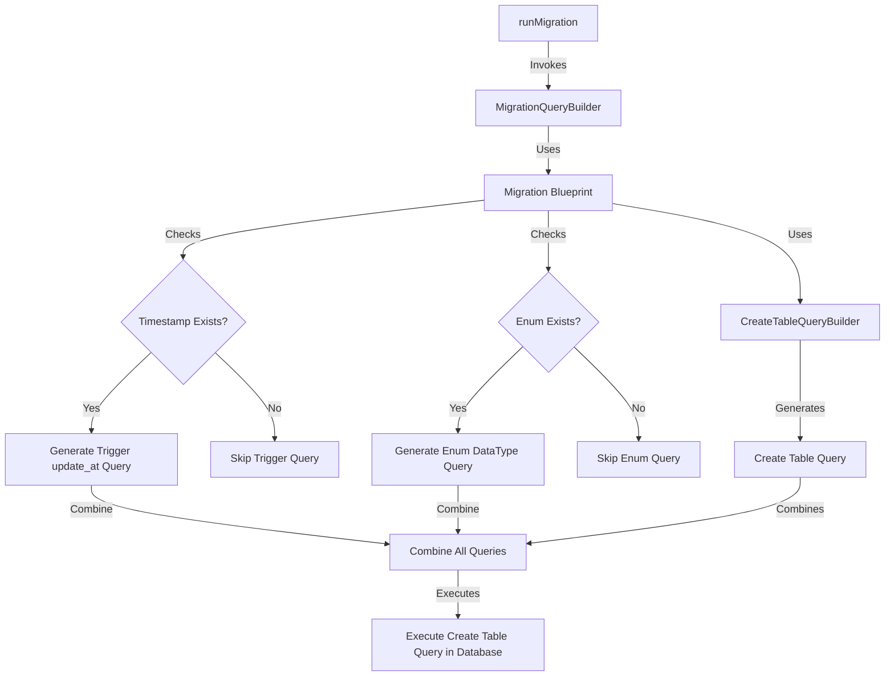

# dwi-express-orm

# Project Name

## Table of Contents
1. [Introduction](#introduction)
2. [Requirements](#requirements)
3. [Architecture](#architecture)
4. [Database Schema](#database-schema)
5. [API Documentation](#api-documentation)
6. [Setup and Installation](#setup-and-installation)
7. [Usage](#usage)
8. [Testing](#testing)
9. [Contributing](#contributing)
10. [License](#license)

---

## Introduction
Project ini dibuat sebagai kerangka kerja pribadi untuk project berbasis server api menggunakan expressJS

### Goals
- [ ] Table Migration
- [ ] Table Seeder
- [ ] Table Truncator for testing purpose
- [ ] Model Mapper
- [ ] Query Builder
- [ ] BaseModel Class
- [ ] BaseController Class

---

## Requirements
List all prerequisites for the project.

### Software Dependencies
- Language: Node.js
- Framework: Express.js
- Database: PostgreSQL

---

## Architecture
arsitektur yang digunakan dalam project ini adalah Modular Monolithic Architecture dikarenakan project ini akan dikunakan di banyak project lain sebagai sebuah modul

### Diagram

1. Table Migration
untuk saat ini hanya create table migration yang dapat digunakan


### Components
1. **Express Server**: Handles HTTP requests and routes.
2. **PostgreSQL Database**: Stores application data.

---

## Migraion Schema
Define the database schema and relationships between tables.

### Example Schema
```javascript
module.exports = {
    tableName: "users",
    timestamp: true,
    columns: [
        {
            columnName: "id",
            dataType: "INT",
            nullable: false,
            autoIncrement: true,
        },
        {
            columnName: "roleId",
            dataType: "INT",
            nullable: true,
            references: {table:'roles', key:'id'}
        },
        {
            columnName: "username",
            dataType: "VARCHAR(100)",
            nullable: false,
            unique: true
        },
        {
            columnName: "email",
            dataType: "VARCHAR(255)",
            nullable: false
        },
        {
            columnName: "password",
            dataType: "VARCHAR(255)",
            nullable: false
        },
        {
            columnName: "status",
            dataType: "ENUM('active', 'inactive', 'suspended')",
            nullable: false,
            default: "'active'"
        }
    ]
}
```

### Relationships
- A user can have one role.
- A role belongs to many user.

---

## Setup and Installation

### Install Dependencies
```bash
npm install dwi-exoress-orm
```

### Configure Environment Variables
Create a `.env` file with the following:
```
DB_HOST=localhost
DB_USER=your-username
DB_PASSWORD=your-password
DB_NAME=your-database-name
DB_PORT=5432
```

### Run Migrations
```bash
npx sequelize-cli db:migrate
```

### Run Application
```bash
npm start
```

---

## Usage
Provide examples of how to use the software.

---

## Testing

### Run Unit Tests
```bash
npm run test
```

---

## License
[MIT License](LICENSE)
